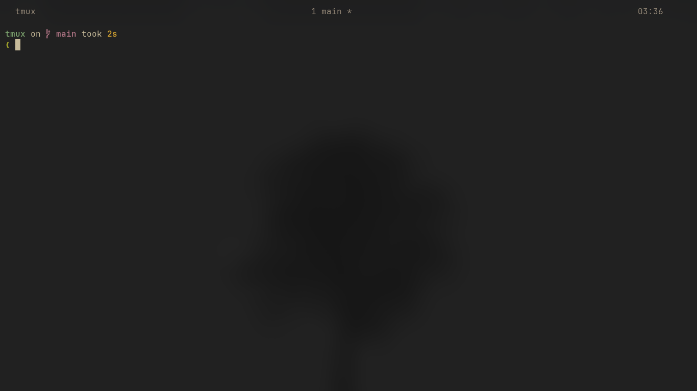

# .tmux.conf

## i love tmux

- who doesnt
- Simple config

---

### Before installation

```bash
sudo apt update && sudo apt install tmux
```

---

### instruction

1. Clone This Repositories

```bash
git clone https://github.com/hellopradeep69/tmux.git
```

or

1. Recommended way

```bash
mkdir ~/tmux-temp
git clone https://github.com/hellopradeep69/tmux.git ~/tmux-temp
cp ~/tmux-temp/.tmux.conf ~/.tmux.conf
rm -rf ~/tmux-temp
```

2. dont forget tmp plugin.. BRUH!

```bash
git clone https://github.com/tmux-plugins/tpm ~/.tmux/plugins/tpm
```

---

### scripts that are and you should try

[topen](https://github.com/hellopradeep69/topen.git)

[tmenux](https://github.com/hellopradeep69/Tmenux.git)

---

### screenshot

~- no screenshot for you ig !!! find out yourself how it look lol .~



---

# bye bye
